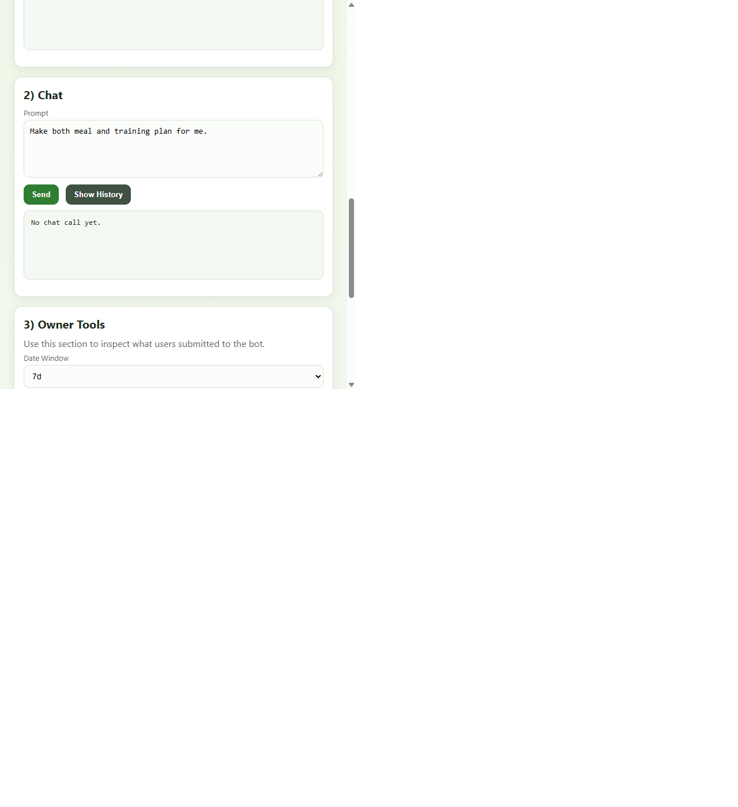

# Diet-Training Bot

[](https://github.com/torbjorc-web/Diet-Trianing-bot/actions/workflows/tests.yml)

A chatbot that generates meal and training plans based on user preferences.

## Live Demo

Production URL: [diet-training-bot.onrender.com](https://diet-training-bot.onrender.com/)

## Chatbot Preview



Live portal GIF demo captured from production.

## Features

- Meal plan generation
- Training plan creation
- User onboarding and profiles
- FastAPI web server
- CLI interface

## Installation

Install dependencies:

```bash
pip install -r requirements.txt
```

## Running

### Demo

```bash
python -m chatbot.demo
```

### CLI

```bash
python -m chatbot.cli
```

### API Server

```bash
uvicorn chatbot.api:app --reload
```

Open `http://127.0.0.1:8000/` in your browser.

## API Endpoints

- `GET /health` - Health check
- `GET /` - Customer portal
- `POST /chat` - Single chat request
- `GET /admin/users` - List users (admin only)

## Testing

Run the test suite:

```bash
pytest
```

## Project Structure

- `chatbot/` - Main application code
- `chatbot/engine.py` - Chatbot logic
- `chatbot/planner.py` - Plan generation
- `chatbot/api.py` - FastAPI application
- `tests/` - Test suite

## Environment Variables

- `PORTAL_INVITE_CODE` - Access code for portal
- `ADMIN_VIEW_CODE` - Admin inspection code

## Deployment

Deploy on Render using `render.yaml`.

Set environment variables in Render dashboard before deployment.
